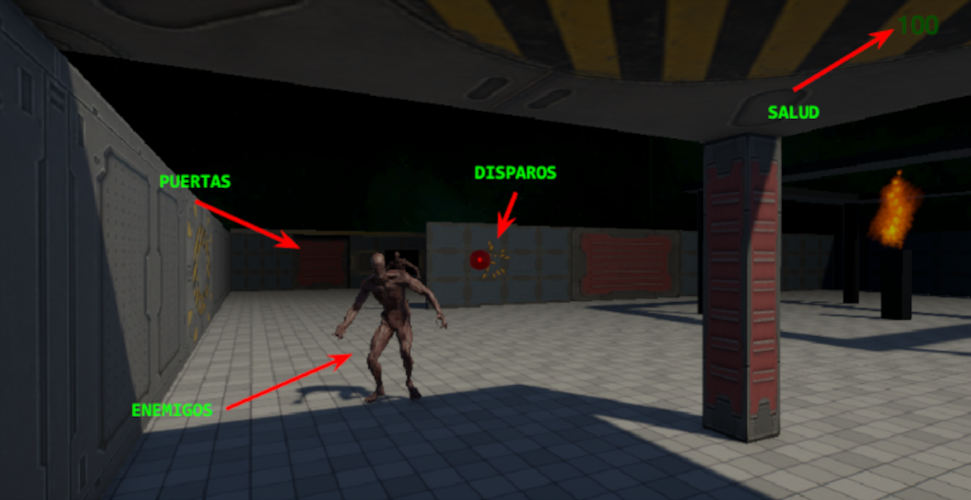
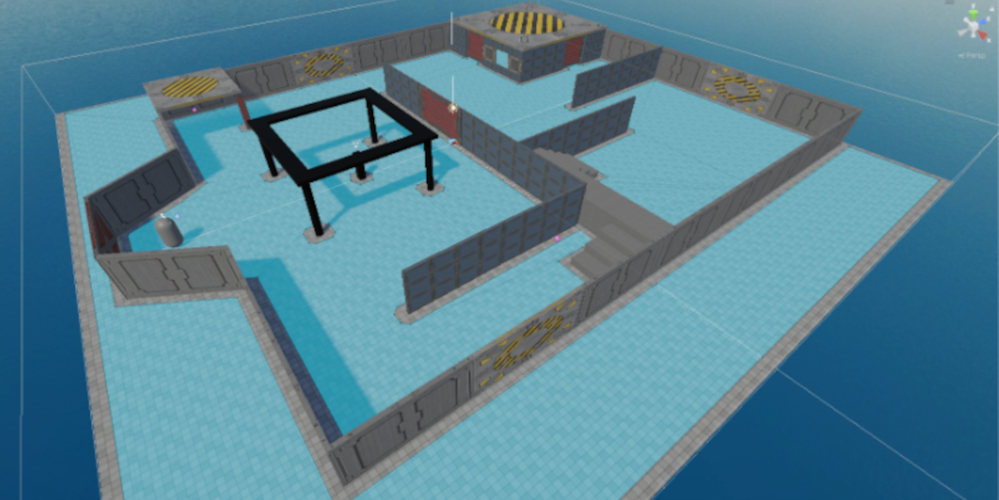

#### C.E. DVRV

### Programación y Motores de Videojuegos

#### Project: Crazy Zombie

`[Unity ver.: 6.0.28f1]`

## Diseño

### Concepto

- **Título:** Crazy Zombie

- **Plataforma:** PC

- **Género:** FPS

- **Cámara:** Juego 3D con vista en primera persona

- **Descripción:**

  - Juego para un jugador en el que el objetivo es sobrevivir a las hordas de zombies que nos atacan.

  - Dispondremos de un arma con la que disparar proyectiles y destruir los zombies.

### Elementos de diseño

### Mapa

### Mecánicas

- El jugador verá el entorno desde una perspectiva de primera persona.

- Podrá manejar a su personaje en cualquier dirección, sin poder abandonar la zona de juego. Podrá realizar acciones como correr, saltar, subir escaleras,... 

- El escenario se podrá explorar libremente. Podrán existir diversas zonas sólo accesibles tras una determinada acción (abrir puerta, cruzar portales,...).

- Inicialmente, el jugador dispondrá de cierta cantidad de vida o salud.

- Los enemigos perseguirán al jugador y le “arrebatarán” salud al entrar en contacto con él.

- El jugador podrá disparar y eliminar a los enemigos.

- Podrán existir diferentes items (coleccionables, power-ups,...).

### Mecánicas adicionales

- Se emplearán modelos tridimensionales de tipo “humanoide”para los enemigos.

- Los enemigos podrán tener diversas animaciones (correr, atacar, pausa,...) que se activarán en función de su estado.

- Los enemigos se destruirán tras recibir un número determinado de impactos del arma del jugador.

- Podrá implementarse un sistema de rondas para las hordas enemigas.

- La escena podrá contener otros elementos gráficos (fuego, explosiones,...) generados mediante sistemas de partículas.

- Existirá una música ambiente y efectos sonoros para las acciones o situaciones más relevantes.

